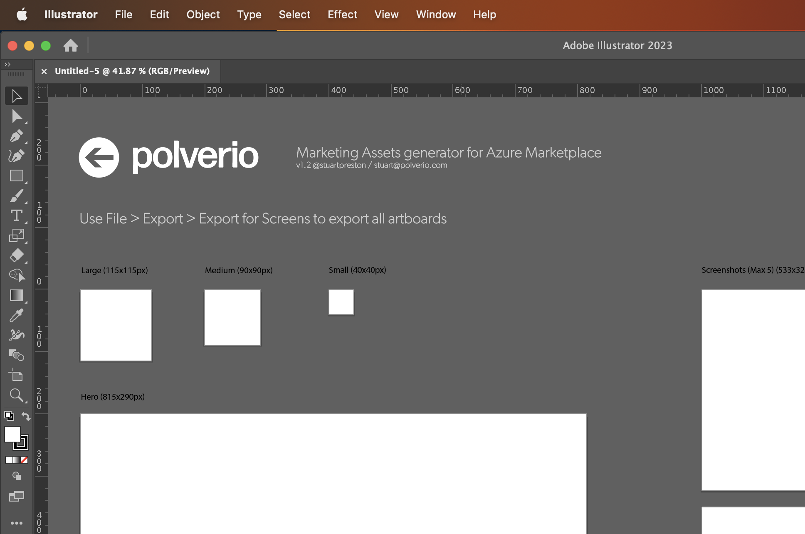

# Azure Marketplace - Marketing Asset generator

An Adobe Illustrator template (.ait) to help when creating gallery assets for the Azure Marketplace. This template can be useful to build out your marketing assets for Azure Solution Templates, Managed Applications/Service Catalog, etc.

## Why?

The Azure Marketplace/Cloud Partner Portal requires assets that are precisely sized. This template helps with that by providing artboards to drop your work into.

## Usage

* Download the .ait file and open with Adobe Illustrator.

 

* Drop your designs on the relevant artboard.
* File > Export > for Screens

* Use the exported files in the Cloud Partner Portal or Partner Portal.
* (profit!)

## License

 This work is licensed under a <a rel="license" href="http://creativecommons.org/licenses/by/4.0/">Creative Commons Attribution 4.0 International License</a>.
